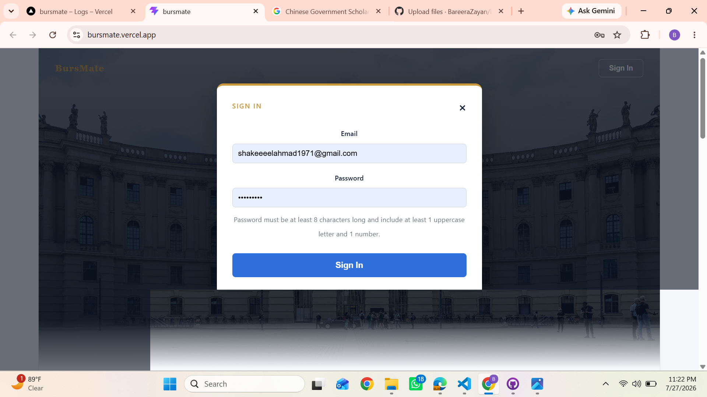
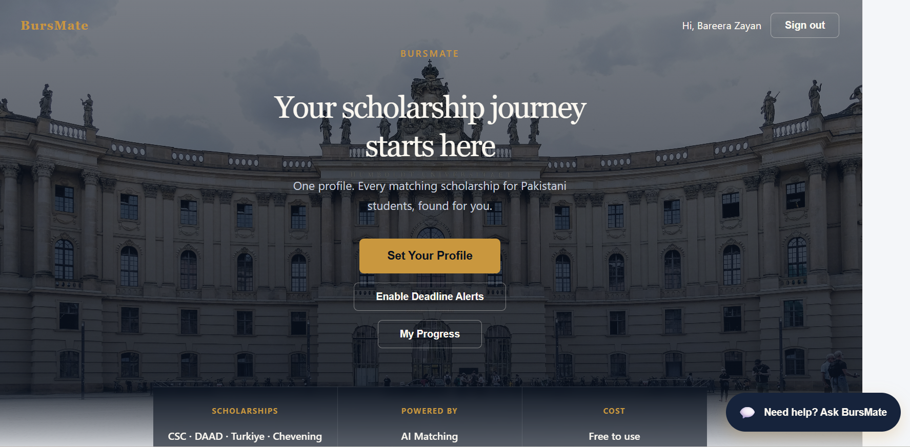
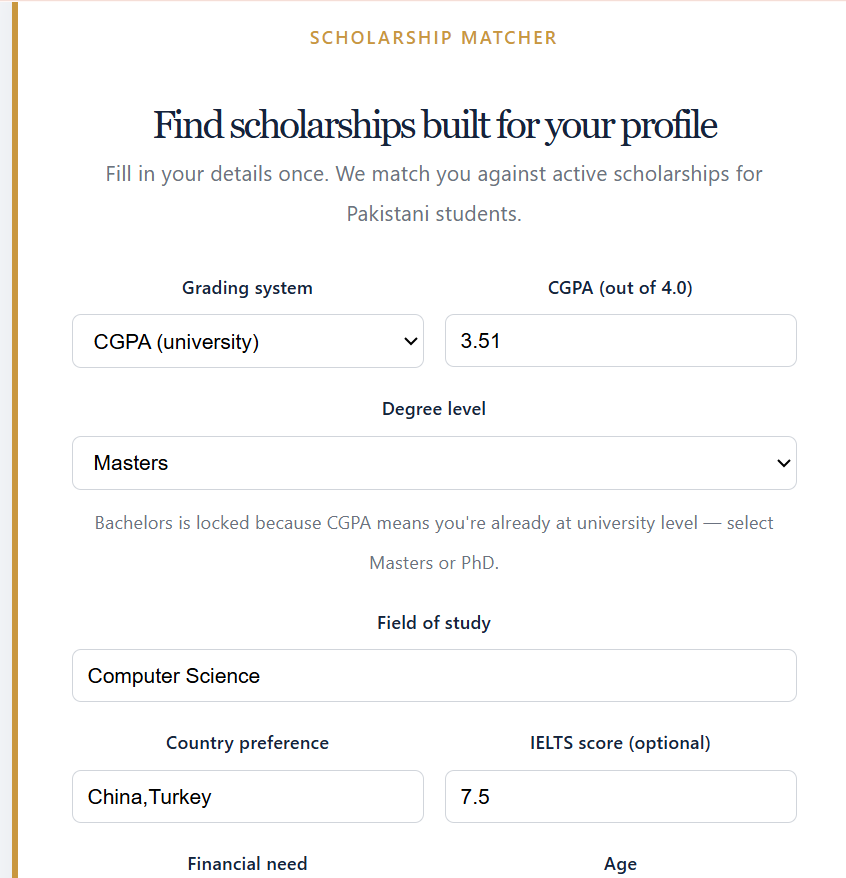
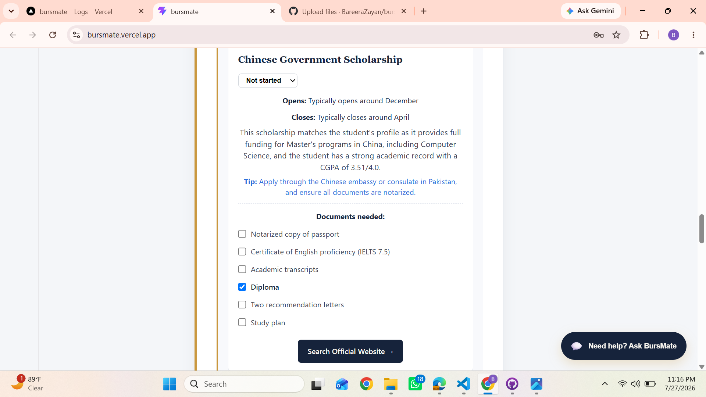
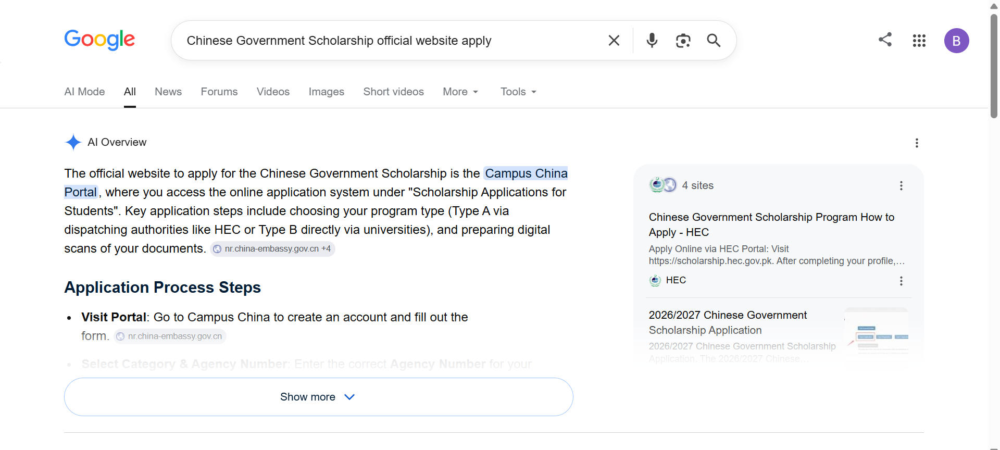
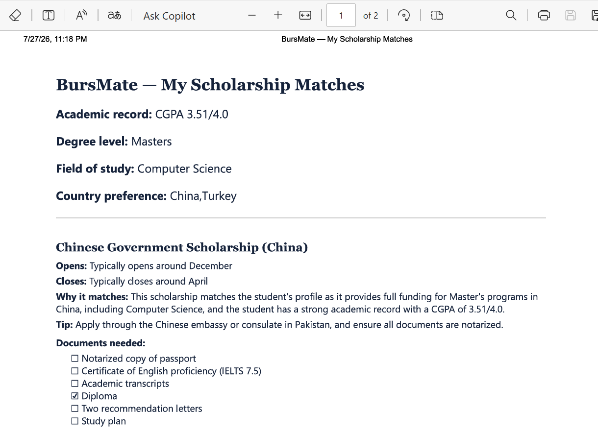
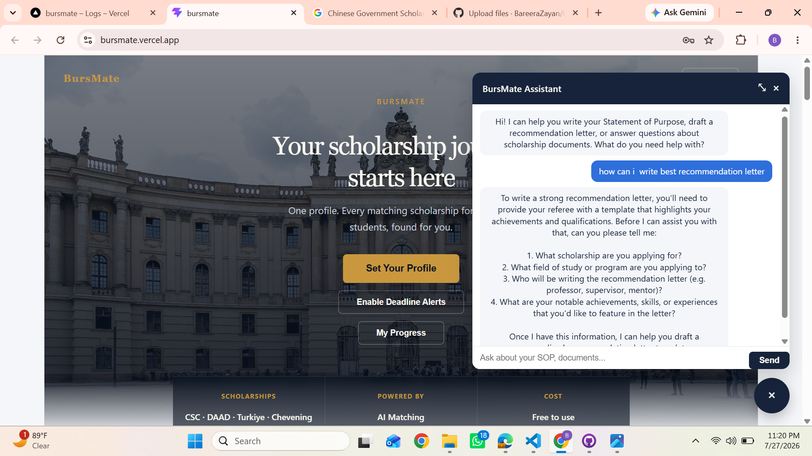

# BursMate

**Live app: [https://bursmate.vercel.app](https://bursmate.vercel.app)**

BursMate is an AI-powered scholarship navigator built for Pakistani students planning to study abroad like Bachelors, Masters, or PhD.

## The problem, and who it's for

Every year thousands of Pakistani students look for scholarships to study abroad like CSC, Türkiye Bursları, Chevening, DAAD, Erasmus Mundus, and dozens of others and almost none of that information lives in one place. Eligibility rules are different for every scholarship, deadlines are scattered across random websites and Facebook groups, and most students end up either missing a scholarship they actually qualified for, or wasting weeks reading about ones they never had a real chance at.

This is built specifically for that student: someone in Pakistan, at Bachelors, Masters, or PhD level, who has no single reliable place to check "which of these scholarships am I actually eligible for, right now, with my own grades and profile." BursMate takes their academic profile once, and tells them which real, currently open scholarships actually fit, why they fit, what documents they'll need, and lets them track their progress on each one until submission.

## Live URL

**[https://bursmate.vercel.app](https://bursmate.vercel.app)** open, sign up, and use it directly. No login is shared/demo; anyone can create their own account.

## Features

Everything below is live and working in the deployed app, not planned or partial:

- Email/password login: The whole app sits behind auth, passwords are hashed with bcrypt, sessions handled with JWT
- A profile form (CGPA/Intermediate %, degree level, field of study, preferred country, IELTS score, financial need, age, gender) that gets sent to an AI model, which returns 5 real, currently active scholarships matched to that profile
- Each match comes as its own card: likely opening/closing window, why it fits the student's profile, a practical tip, and the documents needed
- A document checklist per scholarship so a student can tick off what they've already prepared (saved locally, so it's still there next time they open the app)
- A status tracker per scholarship — Not started / In progress / Submitted
- A "My Progress" page that pulls together the saved profile and every scholarship being tracked, in one view
- A floating AI chat assistant that helps draft a Statement of Purpose, put together a recommendation letter template, or just answer questions about what a scholarship needs and conversation is saved locally
- One-click PDF export of the whole thing — profile, scholarship details, and which documents are checked and opens in a new tab ready to save
- Instead of sending students to an AI-guessed link for the "official site" (which can be wrong or outright made up), the app links to a Google search for the verified official page but it's small thing, but it matters when the stakes are a real application
- Push notifications for deadlines and this part is fully built on the backend: scholarship deadlines sit in a MongoDB collection, and a Vercel Cron job runs daily, checking what's closing within 7 days and pushing browser notifications to anyone subscribed
- Custom-designed UI, navy/gold theme, a "how it works" section, scroll animations nothing off a template

## The AI feature

BursMate uses Groq's 'openai/gpt-oss-120b' model in two places, and both prompts are ones I wrote and iterated on myself.

**Scholarship matcher** : When a student submits their profile, this is the prompt sent to the model:

"You are a scholarship advisor helping Pakistani students. Respond only in English, and respond with ONLY valid JSON, no markdown, no code fences, no extra text before or after. Student profile: [academic record, degree level, field of study, country preference, IELTS score, financial need, age, gender]. Suggest 5 real, currently active scholarships available to Pakistani students (e.g. CSC, Turkiye Burslari, Chevening, DAAD, Erasmus Mundus) that match the profile above. Return a JSON array with exactly this shape: [{ name, country, opens, closes, why, tip, documents }]."

The response comes back as structured JSON, not raw text and that's what lets it become actual interactive cards with checklists and tracking, instead of just a wall of AI-generated text.

**Chat assistant** :This one runs on a persistent system prompt:

"You are a helpful assistant inside BursMate, a scholarship platform for Pakistani students. You help students in three main ways: (1) Drafting or improving a Statement of Purpose (SOP)... (2) Drafting recommendation letter templates... (3) Explaining what documents a specific scholarship typically requires and how to prepare each one. Always ask a clarifying question first if the student has not given enough detail to write something useful. Keep answers practical, structured, and specific. Respond in English."

## Built with

- Frontend: Vite + React
- AI model: Groq API, 'openai/gpt-oss-120b'
- Database: MongoDB Atlas — user accounts, push subscriptions, scholarship deadline data
- Auth: custom email/password, `bcryptjs` for hashing, `jsonwebtoken` for sessions
- Push notifications: Web Push API, service worker, Vercel Cron
- Hosting: Vercel (frontend + serverless API routes)
- Git / GitHub

## Screenshots

### Authentication

Custom email/password auth — bcrypt hashing, JWT sessions, enforced password strength.

### Homepage / Dashboard

Navy/gold themed dashboard with one-click access to profile setup, deadline alerts, and progress tracking.

### Profile Form

Student enters CGPA, degree level, field of study, country preference, and IELTS score — this profile is sent to the AI matcher.

### AI Matching Results

Each matched scholarship shows eligibility reasoning, opening/closing window, a practical tip, and a document checklist with status tracking.

### Verified Official Links

Instead of risking an AI-guessed link, the app redirects to a verified Google search for each scholarship's official page.

### PDF Export

One-click export of the full profile, matched scholarships, and checked documents into a shareable PDF.

### AI Chat Assistant

Floating assistant that helps draft a Statement of Purpose, build a recommendation letter template, or answer questions about required documents.


## Running it locally

```bash
git clone https://github.com/BareeraZayan/bursmate.git
cd bursmate
npm install
```

Then add a `.env` file in the root with your own Groq API key, MongoDB URI, JWT secret, and VAPID keys for push notifications and none of that is committed to this repo.

```bash
npm run dev
```
